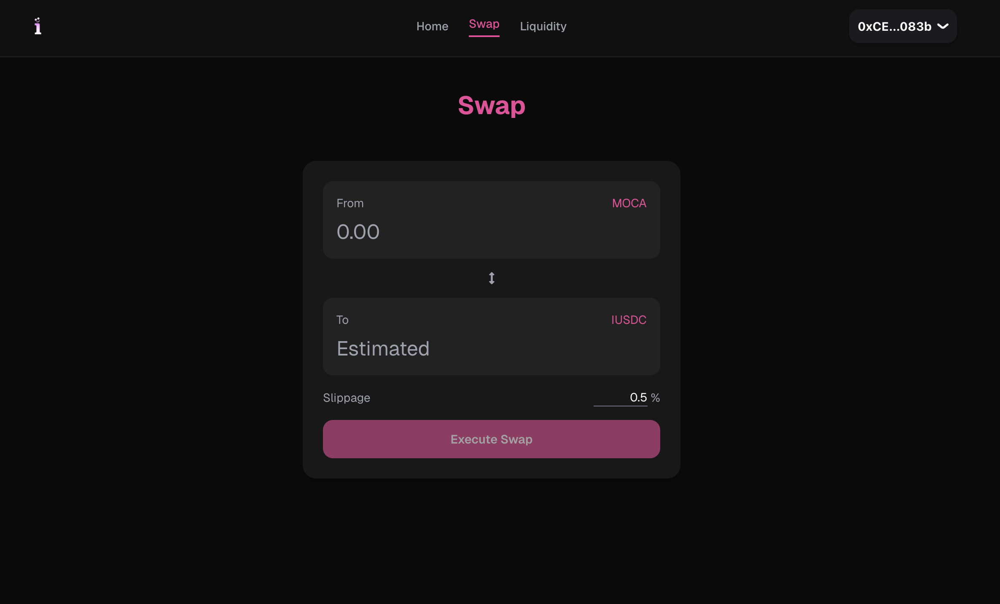
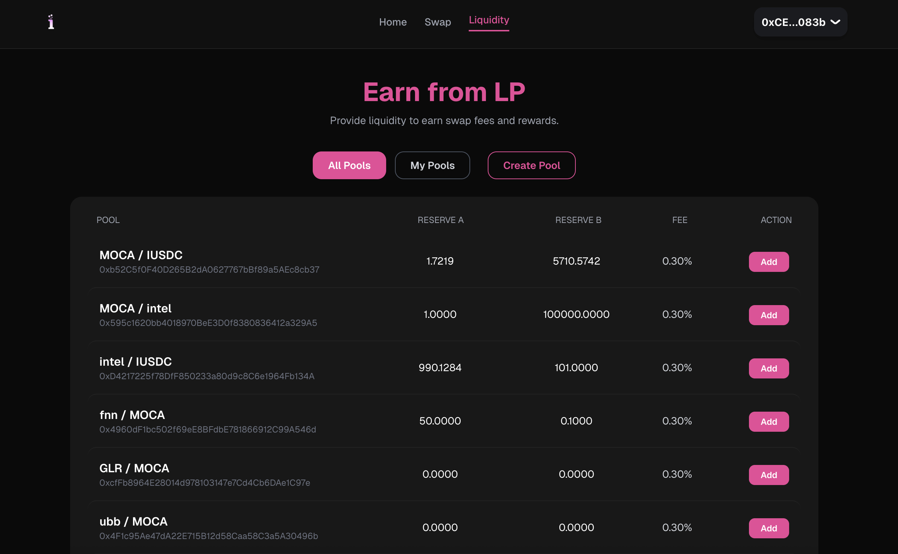
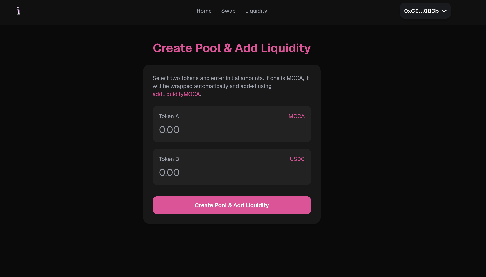

# 💹 Automated Market Maker (AMM) Protocol — Solidity Implementation

A professional-grade, full-stack decentralized exchange (DEX) protocol inspired by Uniswap V2, engineered in Solidity `^0.8.24`. This implementation features advanced **Asynchronous Fee Accounting**, atomic LP reward distribution, and deterministic pair deployment via `CREATE2`.

---


---

## 🖥 User Interface Preview

Experience the seamless integration between the core protocol and the frontend. Built with **Next.js 14**, **Wagmi**, and **Tailwind CSS**.

<p align="center">
  
  
</p>

<p align="center">
  
  <br>
  <em>(Left) Optimized Swap Engine | (Right) Pool Discovery | (Bottom) Comprehensive Liquidity Management</em>
</p>

---

## 📦 Protocol Architecture

| Contract | Responsibility |
|-----------|--------------|
| **DexFactory.sol** | The registry and deployer for all liquidity pairs. Manages protocol-level administrative rights and fee routing. |
| **DexPair.sol** | The core engine handling the $x \cdot y = k$ invariant. Manages reserves, LP token minting/burning, and fee-per-share logic. |
| **DexRouter.sol** | Stateless periphery contract that orchestrates complex multi-step interactions like liquidity provision and multi-token swaps. |
| **WNATIVE.sol** | A high-performance wrapper for the native network token (WMOCA), enabling full ERC-20 compatibility within the protocol. |


---

## ⚙️ Technical Features

- 🧮 **Invariant Engine:** Implements the Constant Product Formula ($x \cdot y = k$) for trustless, automated price discovery.
- 💰 **Real-Time Fee Distribution:** Features a **Claimable Fee Model**, allowing Liquidity Providers to harvest trading fees without withdrawing their principal liquidity.
- 🔁 **Native & ERC-20 Support:** Seamless routing for both Native $\leftrightarrow$ Token and Token $\leftrightarrow$ Token pairs.
- 💸 **Dynamic Fee Ratios:** Configurable swap fees (default 0.3%) with a dedicated protocol treasury cut.
- 🛡 **Security Hardening:** Built-in Reentrancy protection and `unchecked` blocks for optimized gas performance.
- 🧱 **Minimal Dependencies:** Self-contained logic using native Solidity 0.8+ overflow protection.
- ⚗️ **Deterministic Deployment:** Uses `CREATE2` assembly for predictable pair addresses across different environments.

---

## 💸 Economic Model (Fee Mechanics)

The protocol implements a split fee structure to ensure both sustainable protocol growth and attractive LP incentives.

| Parameter | Type | Default Value |
|-----------|------|---------------|
| **Swap Fee** | Protocol Variable | 30 bps (0.30%) |
| **Protocol Cut**| Treasury Allocation | 1/6th of total fees |
| **LP Rewards** | Yield Distribution | 5/6th of total fees |

### Example Calculation:
On a swap of **1000 Tokens**:
1. **Total Fee:** 3.0 Tokens (0.30%)
2. **Protocol Treasury:** 0.5 Tokens ($\approx 16.6\%$)
3. **LP Reward Pool:** 2.5 Tokens (Distributed proportionally to all LPs)

---

## 🚀 Integration & Usage

### Adding Liquidity
To provide liquidity, approve the Router for both tokens and call `addLiquidity`:
```solidity
await router.addLiquidity(
    tokenA,
    tokenB,
    amountADesired,
    amountBDesired,
    recipientAddress
);
```

## 🧮 Mathematical Foundations

The protocol determines the output amount of a swap using the following formula:

<p align="center">
  
  <br>
  <em>Protocol Interface and Automated Market Maker Execution</em>
</p>

Where $amountInWithFee = amountIn \cdot 997$ (accounting for the 0.3% fee).
The liquidity minted during the initial deposit is calculated as:

<p align="center">
  
  <br>
  <em>Protocol Interface and Automated Market Maker Execution</em>
</p>


## 🛠 Setup & Testing

### Installation
```bash
npm install
npx hardhat compile
```
### Run Test Suite
```bash
npx hardhat test
```

## 📄 License

This project is released under the MIT License.